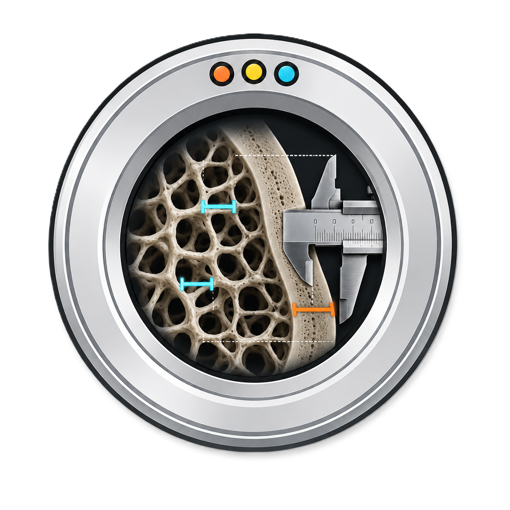

<p align="center">
  
</p>

# Bone Microarchitecture

Lightweight microarchitecture measurements from binary masks and optional calibrated grayscale arrays.

Author: Matthias Walle.

This package intentionally has no Slicer dependency and no image I/O dependency. Callers are responsible for loading images, calibration, and putting masks on a common grid.

## GPU Backends

Exact Hildebrand sphere fitting supports three diameter-accumulation backends:

- `cpu`: NumPy/SciPy fallback.
- `mps`: native Apple Metal backend for macOS.
- `opencl`: OpenCL backend for Windows/Linux systems with `pyopencl` and a working GPU OpenCL runtime.

Use `thickness_backend="auto"` to select Metal on macOS when available, OpenCL on Windows/Linux when available, and CPU otherwise.

Optional installs:

```bash
pip install "bone-microarchitecture[mps]"
pip install "bone-microarchitecture[opencl]"
pip install "bone-microarchitecture[gpu]"
```

## Parameter Definitions

- `Tb.BMD`: mean calibrated grayscale value inside the trabecular compartment.
- `Tb.BV/TV`: trabecular bone volume divided by trabecular total volume.
- `Tb.Th`: maximal-sphere local thickness of trabecular bone.
- `Tb.Sp`: maximal-sphere local thickness of non-bone space in the trabecular compartment.
- `Tb.N`: inverse ridge-to-ridge spacing estimate in the trabecular compartment.
- `Tb.1/N.SD`: standard deviation of ridge-to-ridge spacing.
- `Tb.BV`: trabecular bone volume.
- `Tb.TV`: trabecular compartment volume.
- `Ct.BMD`: mean calibrated grayscale value inside the cortical compartment.
- `Ct.Th`: maximal-sphere local thickness of cortical bone.
- `Ct.Po`: cortical pore volume divided by cortical total volume.
- `Ct.Po.V`: cortical pore volume.
- `Ct.Po.Dm`: maximal-sphere local diameter of cortical pore space.
- `Ct.BV`: cortical bone volume.
- `Ct.TV`: cortical compartment volume.
