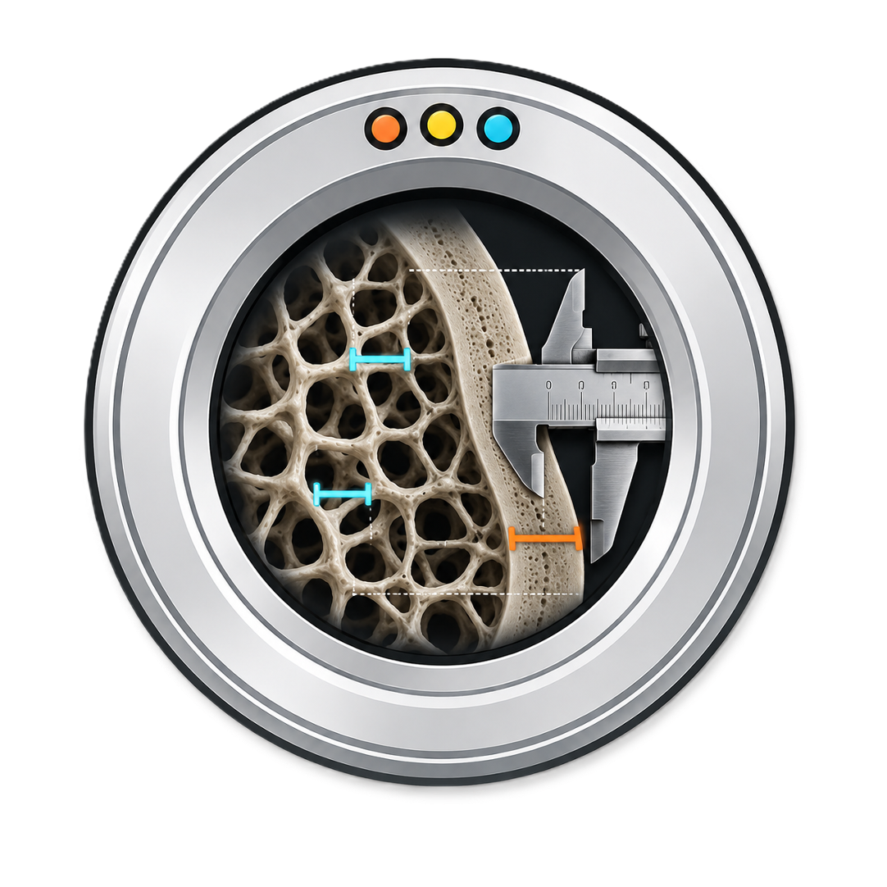

<p align="center">
  
</p>

# Bone Microarchitecture

Lightweight microarchitecture measurements from binary masks and optional calibrated grayscale arrays.

Author: Matthias Walle.

The array measurement API has no Slicer dependency and expects calibrated arrays
on a common grid. File-based batch workflows use SimpleITK (and aimio-py for AIM)
to load inputs and place cropped masks on the grayscale grid with nearest-neighbor
resampling using origin, spacing, and direction. This is grid reconciliation, not
registration; geometry-free arrays must already have the grayscale dimensions.
The grid policy participates in batch cache compatibility so older incompatible
maps are recomputed.

Batch discovery accepts canonical segmentation, periosteal, trabecular, and cortical roles from shared contour derivatives and their sidecars. See [CHANGELOG.md](CHANGELOG.md) for release notes.

## GPU Backends

Exact Hildebrand sphere fitting supports three diameter-accumulation backends:

- `cpu`: NumPy/SciPy fallback.
- `mps`: native Apple Metal backend for macOS.
- `opencl`: OpenCL backend for Windows/Linux systems with `pyopencl` and a working GPU OpenCL runtime.

Use `thickness_backend="auto"` to select Metal on macOS when available, OpenCL on Windows/Linux when available, and CPU otherwise.

Optional installs:

```bash
pip install "bone-microarchitecture[mps]"
pip install "bone-microarchitecture[opencl]"
pip install "bone-microarchitecture[gpu]"
```

## Parameter Definitions

- `Tb.BMD`: mean calibrated grayscale value inside the trabecular compartment.
- `Tb.BV/TV`: trabecular bone volume divided by trabecular total volume.
- `Tb.Th`: maximal-sphere local thickness of trabecular bone.
- `Tb.Sp`: maximal-sphere local thickness of non-bone space in the trabecular compartment.
- `Tb.N`: inverse ridge-to-ridge spacing estimate in the trabecular compartment.
- `Tb.1/N.SD`: standard deviation of ridge-to-ridge spacing.
- `Tb.BV`: trabecular bone volume.
- `Tb.TV`: trabecular compartment volume.
- `Ct.BMD`: mean calibrated grayscale value inside the cortical compartment.
- `Ct.Th`: maximal-sphere local thickness of cortical bone.
- `Ct.Po`: cortical pore volume divided by cortical total volume.
- `Ct.Po.V`: cortical pore volume.
- `Ct.Po.Dm`: maximal-sphere local diameter of cortical pore space.
- `Ct.BV`: cortical bone volume.
- `Ct.TV`: cortical compartment volume.
